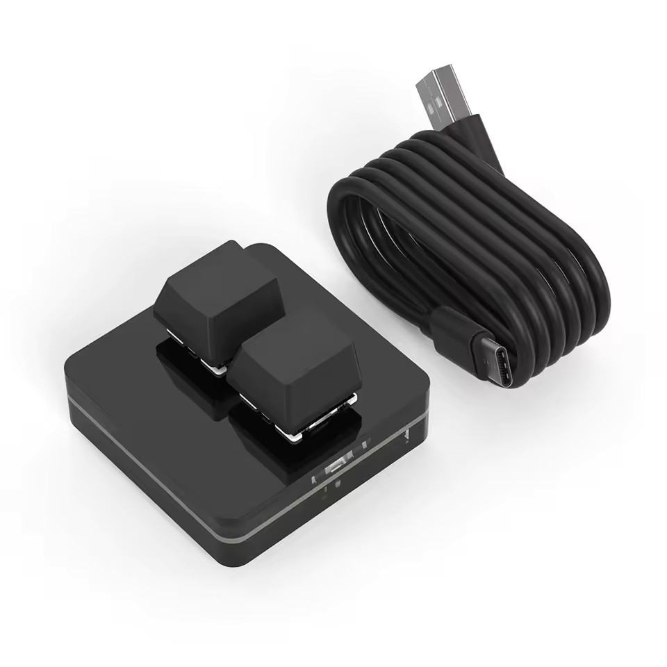

# MacroPad Configuration Tools



[🇬🇧 English](#english) | [🇩🇪 Deutsch](#deutsch)

---

## English

### MacroPad Configuration Tools

This repository contains Python scripts for configuring a SikaiCase MacroPad device with VID:PID 514c:8851. The scripts allow you to set key assignments and change the LED mode.

For the official software and more information, visit: [SikaiCase Software](https://sikaicase.com/de/blogs/support/setting-for-software)

#### Files

- `set_key.py`: Script for setting key assignments for various slots on the MacroPad.
- `set_led_mode.py`: Script for changing the LED mode and color on the MacroPad.

#### Installation

1. Make sure Python 3 is installed.
2. Install the required dependency:

   ```bash
   pip install hid
   ```

#### Usage

##### Setting Keys

Run the `set_key.py` script to assign keys to slots. Example:

```bash
python3 set_key.py --keys A B
```

This assigns 'A' to slot 1 and 'B' to slot 2.

Additional options:
- `--keys`: List of keys (e.g., A, B, Ctrl+A, Shift+B)
- `--raw`: Use raw HID codes

##### Setting LED Mode

Run the `set_led_mode.py` script to change the LED mode. Example:

```bash
python3 set_led_mode.py --mode 4 --color red
```

This sets the mode to 4 with red color.

Supported colors: random, red, orange, yellow, green, cyan, blue, purple.

#### Dependencies

- `hid`: For communication with HID devices.

#### Note

Make sure the MacroPad device is connected and recognized before running the scripts.

---

## Deutsch

### MacroPad Konfigurationswerkzeuge

Dieses Repository enthält Python-Skripte zur Konfiguration eines SikaiCase MacroPad-Geräts mit der VID:PID 514c:8851. Die Skripte ermöglichen es, Tastenbelegungen zu setzen und den LED-Modus zu ändern.

Für die offizielle Software und weitere Informationen, besuchen Sie: [SikaiCase Software](https://sikaicase.com/de/blogs/support/setting-for-software)

#### Dateien

- `set_key.py`: Skript zum Setzen der Tastenbelegungen für verschiedene Slots auf dem MacroPad.
- `set_led_mode.py`: Skript zum Ändern des LED-Modus und der Farbe auf dem MacroPad.

#### Installation

1. Stelle sicher, dass Python 3 installiert ist.
2. Installiere die erforderliche Abhängigkeit:

   ```bash
   pip install hid
   ```

#### Verwendung

##### Tasten setzen

Führe das Skript `set_key.py` aus, um Tasten für die Slots zu setzen. Beispiel:

```bash
python3 set_key.py --keys A B
```

Dies setzt Slot 1 auf 'A' und Slot 2 auf 'B'.

Weitere Optionen:
- `--keys`: Liste der Tasten (z.B. A, B, Ctrl+A, Shift+B)
- `--raw`: Verwende rohe HID-Codes

##### LED-Modus setzen

Führe das Skript `set_led_mode.py` aus, um den LED-Modus zu ändern. Beispiel:

```bash
python3 set_led_mode.py --mode 4 --color red
```

Dies setzt den Modus auf 4 mit roter Farbe.

Unterstützte Farben: random, red, orange, yellow, green, cyan, blue, purple.

#### Abhängigkeiten

- `hid`: Für die Kommunikation mit HID-Geräten.

#### Hinweis

Stelle sicher, dass das MacroPad-Gerät angeschlossen und erkannt ist, bevor du die Skripte ausführst.